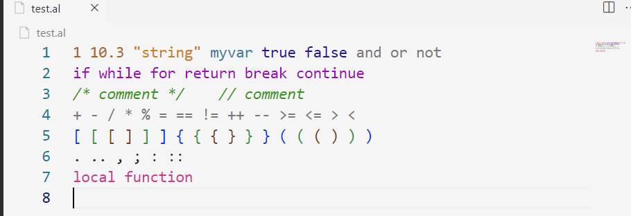

# alpha-language-support README
    Alpha Language Support was created to help write scripts using the alpha language.
    Alpha scripts must have the .al extention

## Features
    Alpha Language Support currently supports:
        -syntax highlighting

## Recommendation
    It is recommended that you use JohnOuz-Light++ theme
    for the best experience when writing alpha scripts 