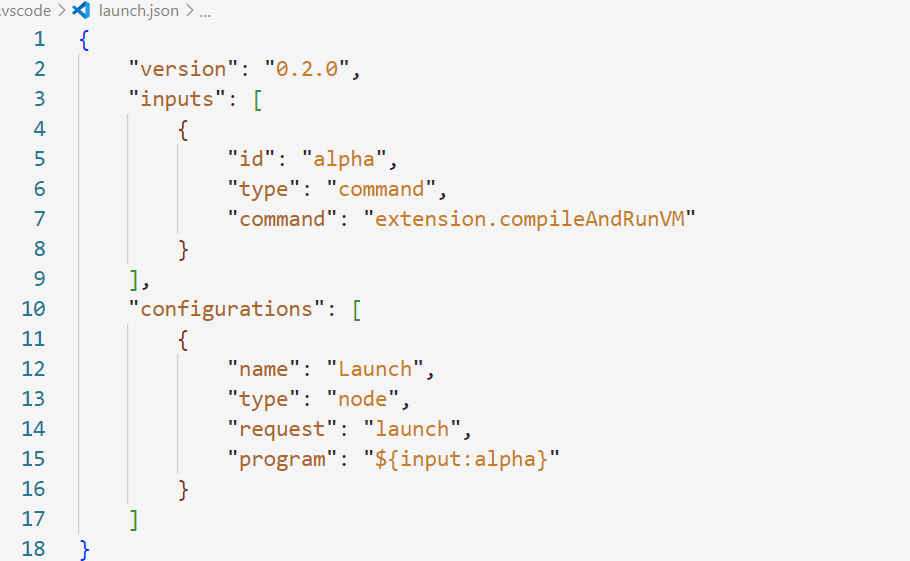

# alpha-language-support
    Alpha Language Support was created to help write scripts using the alpha language.
    Alpha scripts must have the .al extention

## Features
    Alpha Language Support currently supports:
        -syntax highlighting
        -syntax analysis
        -compile and run

## Syntax Analysis

    The syntax analyser is activated upon file save and
    the file is parsed. Error messages can be examined
    in the Output Alpha panel (see View Parse Output on how to open the Output panel).
    The messages are not very accurate but they provide a line number to help with debugging.

    
    The parser can also be activated using the Parse Grammar command.
    To use the command, 
    1) open the command palette with Ctrl+Shift+P
    2) search Alpha Parse Grammar

    The parsing results will be displayed in the Output panel

## Compile and Run VM

    To compile and run an alpha script, 
    1) open the command palette with Ctrl+Shift+P
    2) search Alpha Compile and Run VM

    This will compile the active alpha file
    and produce a .abc file with the same name
    as the active file. 
    Error messages from the compiler will be displayed
    in the Output panel (see View Parse Output on how to open the Output panel).

    The vm runs on a terminal (tested on powershell) and the output is displayed there.

    You can also run an alpha script using F5, to do that
    1) open .vscode folder (create one if it doen't exist)
    2) create a launch.json
    3) in the inputs field add the command: extension.compileAndRunVM
    4) in the configurations add a launch request

    Your launch.json should look like this.

    You can suppress runtime warnings by adding a -Wno argument.

## View Parse Output

    To view the output of the parser
    go to View -> Output (or Ctrl+Shift+U) and select the Alpha panel

## Alpha Syntax

### Types
#### A variable in alpha can be one of the following types
<b>string</b>:
>var = "myvar";
>
>print(typeof(var)); // prints string

<b>number</b>:
>var = 10.2;
>
>print(typeof(var)); // prints number

<b>boolean</b>:
>var = true;
>
>print(typeof(var)); // prints boolean

<b>nil</b>:
>var = nil;
>
>print(typeof(var)); // prints nil

<b>table</b>:
>var = [];
>
>print(typeof(var)); // prints table

<b>function</b>:
>var = ( (<>) => {} ); // lambda definition in an expression
>
>print(typeof(var)); // prints function
>
>var = (function foo(){}); // function definition in an expression
>
>print(typeof(var)); // prints function

<b>library function</b>:
>var = print;
>
>print(typeof(var)); // prints library function

<b>undefined</b>
>var;
>
>print(typeof(var)); // prints undefined

### Tables
In alpha you can define tables by index or key-value pairs.

<b>Indexed</b>
>table = [20.3, "string", true, print];
>
>print(table[1]); // prints string

Indexed tables can only be accessed using the [] operator.

<b>Object</b>
>table = [{"key":10}, {10:"value"}];
>
>print(table[10], " ", table.key); // prints value 10

Object tables can be accessed using the [] operator and . operator if the key is of type string.

#### Functors: 
Objects with the key "()" can be called as a function
>table = [{"()":print}];
>
>table("hello"); // prints hello

Using the '..' operator you can pass the table as the first argument in a function call
>table = [{"foo":( (< this >) => {print(this.x);} )}, {"x":10}];
>
>table..foo(); // prints 10

### Function calls
In alpha a function can be called in three ways:
1) normal call
>function foo(){}
>
>foo();

2) functor
>table = [{"()":print}];
>
>table("hello"); // prints hello

3) string call
>func = "print";
>
>func("hello"); // prints hello
