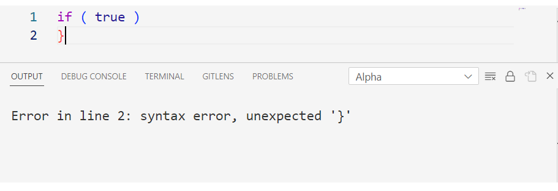

# alpha-language-support
    Alpha Language Support was created to help write scripts using the alpha language.
    Alpha scripts must have the .al extention

## Features
    Alpha Language Support currently supports:
        -syntax highlighting
        -syntax analysis
        -compile and run

## Syntax Analysis

    The syntax analyser is activated upon file save and
    the file is parsed. Error messages can be examined
    in the Output Alpha panel (see Compile and Run VM on how to open the Output panel).
    The messages are not very accurate but they provide a line number to help with debugging.

    
    The parser can also be activated using the Parse Grammar command.
    To use the command, 
    1) open the command palette with Ctrl+Shift+P
    2) search Alpha Parse Grammar

    The parsing results will be displayed in the Output panel

## Compile and Run VM

    To compile and run an alpha script, 
    1) open the command palette with Ctrl+Shift+P
    2) search Alpha Compile and Run VM

    This will compile the active alpha file
    and produce a .abc file with the same name
    as the active file. To view the output of the script
    go to View -> Output (or Ctrl+Shift+U) and select the Alpha panel

    Error messages from the compiler and the vm will also display
    in this panel

## Syntax Highlighting
    
    An example of how every token looks like using
    the JohnOuz-Light++ theme

